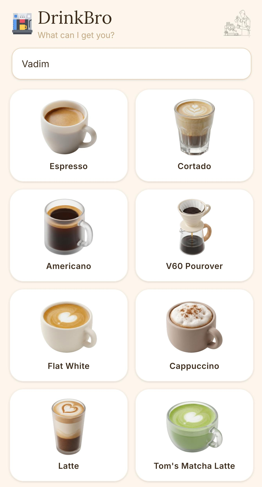
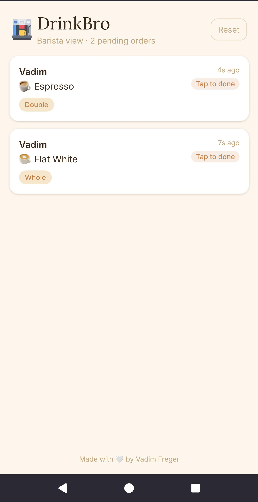

# DrinkBro

A minimal drink ordering app for small gatherings. Guests browse a menu and place orders; whoever's making drinks watches a live queue on the barista screen.

Built with Next.js, Turso (SQLite), and Server-Sent Events for real-time updates.

## How it works

- **Guest view** (`/drink/<slug>`) — pick a drink, add your name, tap to order
- **Barista view** (`/barista/<slug>`) — live order queue, tap to mark done, revert, or reset
- **Root** (`/`) — returns 404, keeping the app undiscoverable by default

Access is gated by a secret URL slug. Generate one and share it as a QR code — guests scan it and they're in. No accounts, no passwords.

## Screenshots

| Guest ordering | Barista dashboard |
|---|---|
|  |  |

## Getting started

```bash
npm install
```

Create a `.env.local` file (gitignored):

```
TURSO_DATABASE_URL=http://127.0.0.1:8080
TURSO_AUTH_TOKEN=
HASH_SLUG=your_secret_slug
```

Then start the local database server and dev server in separate terminals:

```bash
npm run dev:db   # terminal 1 — local libSQL server on port 8080
npm run dev      # terminal 2 — Next.js on localhost:3000
```

Open `http://localhost:3000/drink/your_secret_slug`.

If `HASH_SLUG` is not set, any slug is accepted (useful for local development).

To generate a slug:

```bash
openssl rand -hex 8
```

To test from another device on your local network, add your machine's IP to `next.config.ts`:

```ts
allowedDevOrigins: ["192.168.x.x"],
```

## Customizing the menu

Edit `menu.json`. Each drink references customization IDs defined in the `customizations` map.

```json
{
  "customizations": {
    "milk": { "label": "Milk", "type": "select", "options": ["Whole", "Oat"], "default": "Whole" },
    "sugar": { "label": "Sugar", "type": "toggle", "default": false }
  },
  "drinks": [
    { "id": "latte", "name": "Latte", "emoji": "☕", "customizations": ["milk", "sugar"] }
  ]
}
```

Customization types:
- `toggle` — checkbox, adds the label when true
- `select` — dropdown from `options`, shown when not the default

## Deploying to Vercel + Turso

### 1. Create a Turso database

```bash
turso db create drinkbro
turso db show drinkbro           # copy the https:// URL
turso db tokens create drinkbro  # copy the token
```

### 2. Deploy to Vercel

Push to GitHub, import the project on Vercel, and set these environment variables:

| Variable | Value |
|----------|-------|
| `TURSO_DATABASE_URL` | `https://your-db.turso.io` (must be `https://`, not `libsql://`) |
| `TURSO_AUTH_TOKEN` | token from `turso db tokens create` |
| `HASH_SLUG` | your secret slug |

The database table is created automatically on first request.

## Tech stack

- [Next.js](https://nextjs.org) (App Router, serverless + edge functions)
- [Turso](https://turso.tech) (libSQL remote SQLite, `@libsql/client`)
- [Tailwind CSS v4](https://tailwindcss.com)
- Server-Sent Events for live queue updates (Edge Runtime, polls DB every 2s)
